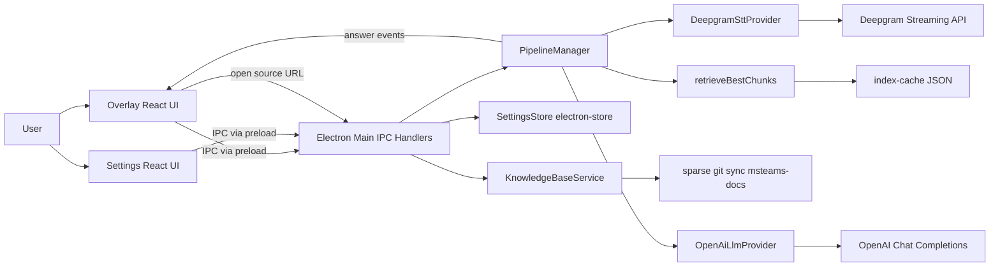
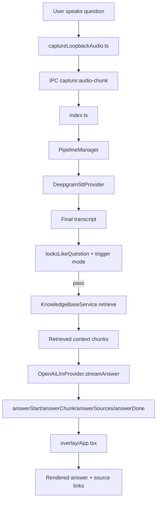

# Current State Architecture

## What the application is today

This repository is a Windows-first Electron desktop assistant that listens to meeting audio, detects likely questions, retrieves related snippets from a locally indexed Microsoft Teams developer docs repository, and streams an OpenAI-generated answer into an always-on-top overlay.

It is currently a single-user, desktop-local, API-key based application optimized for live call support and demos.

## Product behavior as a system

### User-facing functionality

- A floating **overlay window** for live transcript + answers.
- A **settings window** for API keys, capture behavior, overlay placement, demo mode, and knowledge-base sync.
- Live capture modes:
  - system audio
  - microphone
  - both
- Answer trigger modes:
  - only question-like utterances
  - all finalized utterances
- Manual knowledge sync from `MicrosoftDocs/msteams-docs`.
- Source links per answer that open corresponding GitHub Markdown pages.

### Major workflows

1. User starts capture in overlay.
2. Renderer captures audio from selected sources and sends PCM chunks to main via IPC.
3. Main process streams audio to Deepgram STT.
4. Finalized transcripts are question-gated.
5. If gated in, KB retrieval runs against local chunks.
6. OpenAI streaming response is generated using retrieved snippets.
7. Overlay receives answer events (`answerStart`, `answerChunk`, `answerSources`, `answerDone`) and renders a conversational feed.

### Conversational behavior

- Conversation state is **UI-local and ephemeral** (in-memory feed).
- No persisted thread/conversation store.
- Follow-up behavior exists via prompt construction and explicit `askQuestion` calls, not a dedicated conversation memory service.
- Deterministic answer pairing is handled through an explicit `answerStart` event.

### Knowledge / retrieval behavior

- Knowledge source: sparse clone of `msteams-platform` subtree from `MicrosoftDocs/msteams-docs`.
- Indexing:
  - parse frontmatter (`title`, `description`, `ms.topic`)
  - split by `#`/`##`
  - chunk around ~1200 chars
  - build normalized `searchText`
- Retrieval:
  - keyword/token scoring (title/description/heading/path/body/ms.topic boosts)
  - stop-word filtering
  - one chunk per file dedupe
  - top-k (4) return
- No embeddings, no vector DB, no reranker, no semantic router.

### AI / model usage

- STT: Deepgram streaming (`nova-3`) in main process.
- LLM: OpenAI chat completions streaming (`gpt-4o-mini`) in main process.
- Prompting:
  - topic template from settings
  - policy constraints in `openAiLlmProvider.ts`
  - retrieved snippets injected into user prompt

### Persistence

- `electron-store` for app settings.
- API keys stored encrypted-at-rest using Electron `safeStorage` when available.
- Knowledge index cache persisted as JSON.
- No persistent conversation history.

### APIs and integrations

- Integrations:
  - Deepgram API
  - OpenAI API
  - Git remote for docs sync
  - Electron shell for opening external links
- IPC API between renderer and main via preload bridges (`overlayApi`, `settingsApi`).

### Authentication and secrets

- No user identity/auth system.
- API keys are user-provided (settings or `.env` fallback).
- No role-based access, tenant binding, or delegated Microsoft auth.

### Frontend and backend split

- Frontend:
  - React overlay + React settings app
  - audio capture logic in renderer
- Backend:
  - Electron main process orchestrates STT, retrieval, LLM, settings, and IPC.

### Runtime and deployment assumptions

- Runtime: desktop Electron app, primarily Windows 10/11.
- Build/distribution: `electron-vite` + `electron-builder` (NSIS).
- Assumes local `git` and network access for KB sync.
- Assumes microphone/display-capture permissions at OS/browser layer.

## Current-state architecture diagram

## Question trace (actual repository flow)

## Where key concerns live

- Prompts: `src/main/services/openAiLlmProvider.ts`
- Model calls: `deepgramSttProvider.ts`, `openAiLlmProvider.ts`
- Retrieval: `src/main/services/knowledgeBase/retriever.ts`
- Embeddings: **none**
- External data fetch:
  - Git clone/pull in `knowledgeBase/gitSync.ts`
  - Deepgram/OpenAI API calls
- Conversation storage: **none persisted** (overlay in-memory feed only)
- Citations/source links:
  - generated in `PipelineManager.toSourceRefs()`
  - rendered in overlay cards
- Configuration:
  - defaults in `src/shared/constants.ts`
  - persisted settings in `src/main/store/settingsStore.ts`
- Secrets:
  - settings store encrypted values + `.env` fallback
- Error handling:
  - local try/catch around STT/LLM and sync flows
  - surfaced mainly as transcript/error strings in overlay
  - no centralized telemetry, retry policy, or error taxonomy

## Inferred implicit product requirements

### Intentional product behavior

- Assist live calls with low-latency transcript+answer overlay.
- Prefer grounded answers from selected Teams docs.
- Keep setup lightweight (API keys + one settings page).
- Preserve privacy option via capture exclusion demo toggle.

### Architectural decisions

- Electron desktop shell (vs browser web app) to support audio capture and always-on-top overlay.
- Main-process orchestration with IPC contracts.
- Local markdown index/cache instead of hosted retrieval services.

### Implementation shortcuts

- Lexical retrieval only; no semantic retrieval.
- Prompt-only grounding with no verifier/citation checker.
- Single-process orchestration with minimal modular boundaries.
- Heuristic question detector as primary routing.

### Technical debt / incomplete ideas

- No robust conversation/session memory model.
- No doc authority hierarchy beyond one repo.
- No freshness/validity checks per answer.
- No production-grade observability, evaluation, or policy layer.
- No multi-domain query router (Teams admin/Graph/Entra/etc.).

## Component disposition baseline

This table describes current code quality/fit without yet choosing migration strategy.

- **Overlay + Settings windows (Electron + React): REFACTOR**
  - Solid UX shell, but event/state coupling is ad hoc and has suffered ordering/clarity issues.
- **IPC boundary via preload: KEEP**
  - Correct security pattern for Electron, extend with stricter contracts.
- **Audio capture + source routing: REFACTOR**
  - Works for POC; needs clearer session lifecycle, testability, and source confidence handling.
- **PipelineManager orchestration: REFACTOR**
  - Correct central concept, but too many responsibilities and weak separation of concerns.
- **QuestionDetector heuristic gate: REPLACE**
  - Useful fallback only; insufficient for production intent routing.
- **KnowledgeBaseService + index/cache: REFACTOR**
  - Good local bootstrap pattern; retrieval/indexing strategy must be upgraded substantially.
- **Retriever (keyword scoring): REPLACE**
  - Fundamentally insufficient for authoritative enterprise Q&A breadth.
- **OpenAiLlmProvider prompting: REFACTOR**
  - Reasonable baseline; requires evidence model, citation rigor, and tool-augmented answer policies.
- **SettingsStore + key handling: KEEP**
  - Appropriate for desktop local config/secret handling.
- **Source citation URL generation: REFACTOR**
  - Useful UX pattern; needs stronger citation provenance and confidence semantics.

