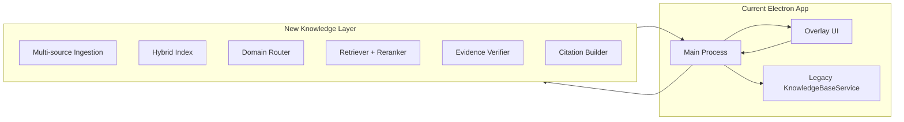

# Rebuild Recommendation

## Decision

**Choose C: Build a new knowledge layer beside the current application and migrate to it.**

## Why this is the right choice

### Why not A (extend as-is)

Directly extending the current lexical retrieval + single-source model will create brittle complexity and still miss the target for authoritative, multi-domain Microsoft admin assistance.

### Why not B (incrementally refactor only inside current layer)

The current layer is conceptually useful but structurally constrained:

- retrieval is fundamentally lexical
- source model is single-repo centric
- no authority/confidence framework
- no domain router

Refactoring this in place risks prolonged instability while preserving wrong abstractions.

### Why not D (full app rewrite)

A full app rewrite would throw away working assets:

- Electron shell and capture UX
- IPC pattern
- settings/key management
- evolving overlay interaction model

These are not the primary bottleneck. The bottleneck is the knowledge and answer orchestration architecture.

### Why C works

A side-by-side knowledge layer lets us:

- keep the desktop UX and capture workflow stable
- replace only the high-risk intelligence subsystem
- test new retrieval/verification behavior behind clear interfaces
- migrate incrementally with measurable quality checkpoints

## Recommended migration strategy

### Phase 1: Stabilize interfaces (no product rewrite)

- Define a formal `AnswerPlan` contract (question, domains, evidence, citations, confidence, refusal reason).
- Keep current overlay/events, but consume the new contract where available.

### Phase 2: Add parallel knowledge orchestration path

- Keep existing legacy KB path as fallback.
- Add sidecar path for multi-source retrieval and verification.
- Compare outputs offline and collect quality metrics.

### Phase 3: Controlled cutover by domain

- Route specific domains (for example Teams admin + PowerShell) to new layer first.
- Keep developer-domain fallback to legacy until parity is met.

### Phase 4: Decommission legacy retrieval

- Remove lexical-only retriever from answer-critical path.
- Retain simple local cache strategy only where justified for offline/speed.

## What should survive a rebuild

### KEEP

- Electron multi-window shell
- Preload/IPC security boundary
- Settings persistence and encrypted key storage
- Audio capture and STT session plumbing concept

### REFACTOR

- Pipeline orchestration boundaries
- Overlay state model and event schema
- Citation presentation UX
- Error handling and observability

### REPLACE

- Retrieval engine (keyword-only)
- Source model (single repo assumption)
- Question gating/routing logic
- Prompt-only evidence policy

### REMOVE

- Any hard-coded assumption that Teams developer docs are sufficient for admin Q&A
- Any fallback behavior that returns weak answers without confidence semantics

## Five highest-risk decisions to resolve next

1. **Knowledge source authority policy**
   - canonical source precedence and tie-break rules
2. **Hybrid retrieval architecture**
   - embedding model, vector store, lexical stack, reranker design
3. **Verification/refusal policy**
   - when to answer, abstain, or route to external reference
4. **Citation fidelity contract**
   - section-level citations, confidence, and stale-source detection
5. **Execution topology**
   - local-only vs service-backed orchestration for long-term maintainability

## Summary judgment

The current app is a credible POC with valuable desktop UX foundations.  
Its knowledge architecture is not sufficient for the authoritative, cross-domain Microsoft assistant target.  
A **side-by-side new knowledge layer migration (Option C)** is the most maintainable and lowest-risk path to production quality.

