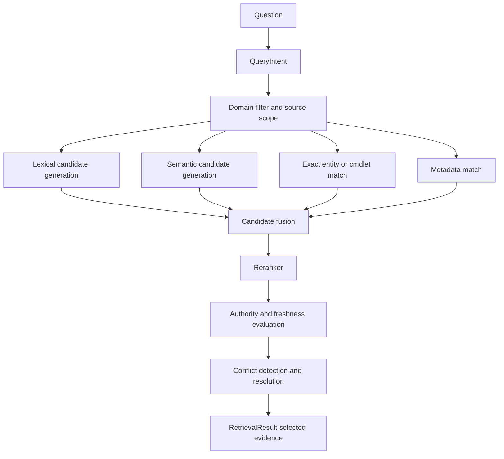

# Retrieval Contract

## 1) Retrieval API boundary

The answer layer should not know retrieval internals.

```typescript
interface RetrieveEvidenceOptions {
  maxCandidates?: number;
  includeBeta?: boolean;
  freshnessMode?: "default" | "strict";
  latencyBudgetMs?: number;
}

interface RetrievalPort {
  retrieveEvidence(
    intent: QueryIntent,
    options?: RetrieveEvidenceOptions
  ): Promise<RetrievalResult>;
}
```

## 2) Retrieval result contract

```typescript
interface RetrievalResult {
  intent: QueryIntent;
  candidates: EvidenceCandidate[];
  selected: EvidenceCandidate[];
  conflicts: EvidenceConflict[];
  freshness: FreshnessAssessment;
  diagnostics: RetrievalDiagnostics;
}

interface EvidenceCandidate {
  candidateId: string;
  chunkId: string;
  documentId: string;
  source: {
    repository: string;
    branch: string;
    filePath: string;
    commitSha: string;
    authorityTier: "tier1" | "secondary";
    sourceDomain: string;
    sourceStatus: "ga" | "beta" | "preview" | "unknown";
  };
  location: {
    headingPath: string[];
    sectionId: string;
  };
  text: string;

  // Scoring dimensions (separate, not collapsed too early)
  scores: {
    lexical: number;
    semantic: number;
    exactMatch: number;
    metadataMatch: number;
    domainMatch: number;
    authority: number;
    freshness: number;
    rerank: number;
    final: number;
  };

  retrievalReasons: string[];
}

interface EvidenceConflict {
  topic: string;
  candidateIds: string[];
  conflictType: "contradiction" | "ga_vs_beta" | "stale_vs_current" | "scope_mismatch";
  resolution?: string;
}

interface FreshnessAssessment {
  status: "current" | "possibly_stale" | "stale" | "unknown";
  checkedViaMcp: boolean;
  checkReasons: string[];
}

interface RetrievalDiagnostics {
  selectedDomains: string[];
  queryTerms: string[];
  lexicalQuery: string;
  semanticQuery: string;
  exactMatchKeys: string[];
  stageLatencyMs: Record<string, number>;
}
```

---

## 3) Hybrid retrieval pipeline



Notes:

- lexical, semantic, exact, and metadata stages run in parallel
- authority/freshness are enforced after relevance fusion
- GA/beta policy is explicit and auditable

---

## 4) MCP role in retrieval

Microsoft Learn MCP is a selective verification layer.

Invoke MCP when one or more conditions are true:

- user asks for latest/current/supported/deprecated status
- licensing or availability question
- local evidence confidence below threshold
- conflicts detected across sources
- GA vs beta ambiguity
- freshness check required by intent policy

Conceptual flow:

```text
local retrieval
  -> evidence evaluation
  -> if freshness/conflict risk
  -> MCP verification augmentation
  -> updated evidence set
```

MCP is not treated as a generic vector corpus.

---

## 5) Technology options and recommendation (retrieval stack)

## Markdown parser

| Option | Advantages | Disadvantages | Operational cost | Local suitability | Recommendation |
|---|---|---|---|---|---|
| Unified/remark ecosystem | Mature AST pipeline, plugin ecosystem | Requires schema discipline | Low | High | **Recommended** |
| markdown-it custom parser | Fast, simple | Less rich AST tooling | Low | High | Alternate |

## Structured document store

| Option | Advantages | Disadvantages | Operational cost | Local suitability | Recommendation |
|---|---|---|---|---|---|
| SQLite (tables + JSON columns) | Embedded, deterministic, easy backup | JSON query ergonomics vary | Low | High | **Recommended** |
| Plain JSON files only | Simple | Harder query/index management | Low | Medium | Not ideal for scale |

## Lexical index

| Option | Advantages | Disadvantages | Operational cost | Local suitability | Recommendation |
|---|---|---|---|---|---|
| SQLite FTS5 | Built-in, no service dependency | Tuning needed | Low | High | **Recommended** |
| Tantivy/Meilisearch sidecar | Powerful ranking options | More moving parts | Medium | Medium | Defer |

## Embedding model

| Option | Advantages | Disadvantages | Operational cost | Local suitability | Recommendation |
|---|---|---|---|---|---|
| OpenAI embeddings API | High quality, simple integration | Remote dependency/cost | Medium | High | **Initial recommendation** |
| Local embedding model | Offline possible | Model ops complexity | Medium/High | Medium | Later optimization |

## Vector index/store

| Option | Advantages | Disadvantages | Operational cost | Local suitability | Recommendation |
|---|---|---|---|---|---|
| SQLite + vector extension (or local ANN library wrapper) | Local, simple deployment | Some ecosystem variance | Low/Medium | High | **Recommended initial path** |
| Dedicated cloud vector DB | Scalable | Unnecessary ops complexity for current app | High | Low | Not recommended now |

## Reranker

| Option | Advantages | Disadvantages | Operational cost | Local suitability | Recommendation |
|---|---|---|---|---|---|
| Lightweight cross-encoder service/API | Better relevance ordering | Extra latency/cost | Medium | Medium | Add after baseline |
| Heuristic fusion only | Fast/simple | Lower quality | Low | High | Baseline phase only |

## MCP client

| Option | Advantages | Disadvantages | Operational cost | Local suitability | Recommendation |
|---|---|---|---|---|---|
| Official MCP client SDK integration | Standardized tool boundary | Requires clear timeout policy | Low | High | **Recommended** |
| Ad hoc HTTP integration | Flexible | Loses MCP contract benefits | Medium | Medium | Not preferred |

---

## 6) Human approvals required before implementation

1. Final source-priority hierarchy and conflict policy
2. Beta handling defaults (`allowsBetaSources`)
3. Freshness threshold that triggers MCP verification
4. Retrieval stage latency budgets and cutoff behavior
5. Initial reranking approach (heuristic-only vs early reranker)

