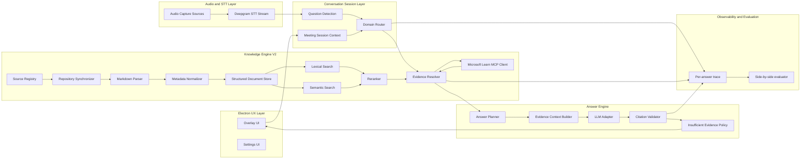

# Target-State Architecture

## 1) Target product behavior (user perspective)

The product remains a real-time Windows/Electron meeting assistant.

When a user asks a question such as:

> How does Teams Direct Routing voice routing work?

the system should:

- detect and normalize the question intent
- identify the likely Microsoft domain(s)
- retrieve authoritative evidence from the correct Microsoft documentation tiers
- verify freshness/conflicts when required
- produce an answer only when evidence is sufficient
- provide reliable citations to concrete source sections
- return quickly enough to be useful in live meetings

This target is a **Microsoft Teams administration research assistant**, not a generic chatbot.

---

## 2) Preserved product boundary

The following stay in place unless a specific future requirement forces change:

- Electron desktop shell
- overlay/settings multi-window UX
- preload-based IPC boundary
- audio capture and source handling
- Deepgram streaming STT plumbing
- local settings storage
- local encrypted API-secret storage

The rebuild scope is the intelligence flow:

```text
question detection/classification
    ↓
domain routing
    ↓
knowledge retrieval
    ↓
evidence evaluation
    ↓
answer planning
    ↓
answer generation
    ↓
citation validation
```

---

## 3) Target logical architecture



These are logical boundaries. They are not automatically separate services.

---

## 4) Runtime topology recommendation

### Electron main process (initial)

- Session orchestration
- IPC ingress/egress
- Question detection + domain routing
- Retrieval orchestration (calls into local KB V2)
- Answer planning + LLM adapter + citation validation
- Source sync scheduling and status

### Worker thread(s) / child process (local)

- Markdown parse + chunk build jobs
- Embedding generation/index updates
- expensive reranking operations

Reason: isolate CPU-heavy indexing from interactive answer latency.

### Local companion process (optional, phase-gated)

- Only if main-process contention becomes measurable
- Keep API boundary identical to in-process interface

### Remote services (not required initially)

- Not required for first target-state implementation
- Allowed later by preserving clean interfaces

#### Topology principle

Optimize first for:

- low-latency local interaction
- deterministic behavior during live calls
- simple local development
- migration flexibility

Do **not** introduce distributed infrastructure prematurely.

---

## 5) Conversation/session scope (minimal)

Prioritize real-time utility over durable memory.

Meeting-session context should include:

- current question
- immediately prior answer
- short transcript window for referents (for example “that policy”)
- active domain/topic hints

Must not include:

- long-term durable memory requirements
- transcript-as-evidence shortcuts

Conversation context can shape interpretation; only evidence can justify claims.

---

## 6) Performance budget (target)

Initial target budgets (p95, local mode):

- question detection + intent normalization: <= 120 ms
- domain routing: <= 80 ms
- local retrieval (lexical + semantic + fusion/rerank): <= 700 ms
- optional Learn MCP verification trigger decision: <= 80 ms
- Learn MCP verification (when invoked): <= 1500 ms additional
- answer planning + context assembly: <= 120 ms
- first token from LLM: <= 1200 ms after retrieval/evidence ready
- total first-token goal:
  - no MCP path: <= 2.2 s
  - MCP path: <= 3.8 s

Concurrency expectations:

- lexical + semantic candidate generation in parallel
- rerank and authority evaluation pipeline-stage parallel where safe
- background index refresh independent from active answer path

---

## 7) Observability requirements

For each answered question, capture:

- original question
- normalized intent + selected domains
- retrieval requests
- candidate evidence set + scoring rationale
- authority/freshness decisions
- MCP invocation decision + result
- selected evidence bundle
- answerability decision
- produced answer + citations
- citation validation result
- stage latency breakdown

Expose full trace in developer/debug mode; keep normal overlay minimal.

---

## 8) Evaluation architecture

Support side-by-side comparison:

- legacy retrieval path
- Knowledge Engine V2 path

For each evaluation sample record:

- legacy answer/result
- V2 retrieval candidates
- V2 selected evidence
- V2 final answer
- citation accuracy
- answerability status
- latency per stage

This enables regression datasets without requiring production users.

---

## 9) Decisions requiring approval before implementation

1. Final Tier-1 source hierarchy and conflict rules
2. Beta/preview handling policy
3. Embedded vector strategy vs local vector DB library
4. MCP invocation thresholds and timeout policy
5. Refusal language and confidence thresholds in user UX

